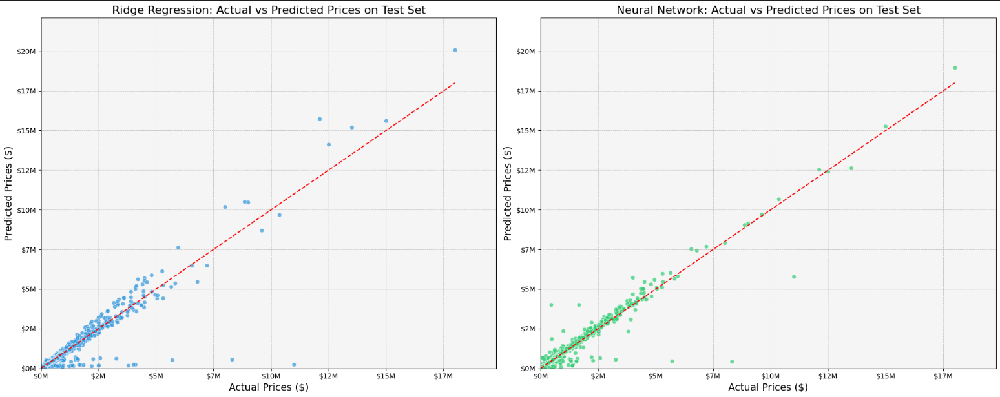

# Real Estate Price Prediction 🏠

Predicting house prices using Ridge Regression and Neural Networks. Data scraped from Redfin represents a sample of 50K houses sold between 2020 and 2023 across all zip codes in Maricopa county.

# Data Preprocessing 🧹
A series of preprocessing steps were undertaken:

- **Feature Engineering**: Derived temporal trends using SALE_YEAR and SALE_MONTH from the SOLD DATE. Calculated the age of each property with PROPERTY_AGE.
- **Feature Selection**: Dropped irrelevant columns to focus on the most pertinent features.
- **Handling Missing Values**: Numerical features were imputed with median, while categorical features used mode.
- **One-Hot Encoding**: 'PROPERTY TYPE', 'CITY', and 'ZIP OR POSTAL CODE' were one-hot encoded.
- **Skewness Treatment**: Positively skewed features underwent log-transformations, while negatively skewed features were cube transformed.
- **Feature Scaling**: Standardized features using the StandardScaler.

## Comparison between Actual and Predicted Prices

## Key Statistics 📈

- **Average House Price:** $531,494.03
- **Median House Price:** $419,240.00

## Metrics 📊

### Ridge Regression
- **Validation MAE:** $34,607.18
- **Test MAE:** $37,900.10
- **Training Time:** 0.08 seconds

### Neural Network
- **Validation MAE:** $43,002.42
- **Test MAE:** $43,957.03
- **Training Time:** 53.90 seconds

## Conclusions 📝

### Historical Context:
Historically, housing price prediction has been approached as a regression task due to the continuous nature of prices.

### Performance:
Ridge Regression outperforms Neural Network on this dataset, indicating the efficiency of simpler models, especially with limited data.

### Interpretability:
Ridge offers a clear understanding of feature impacts, unlike the black-box nature of Neural Networks.

### Training Time:
The swiftness of Ridge Regression can be pivotal for rapid deployment.

### Model Error:
Considering the average and median house prices, the MAE values for both models show an error margin of approximately 7-8%.

## Future Work 🔮

- **Data Enhancement:** Improve and increase the dataset sample size for enhanced Neural Network performance.
- **Tuning:** Optimize hyperparameters for both models.
- **Ensemble Methods:** Combine predictions for potentially better results.
- **Neural Network Exploration:** Refine predictions with different architectures.
- **API Limitation:** Overcome the limitation of the Redfin API, which allows only 350 records per zip code for each time period, to achieve richer datasets.
- **Web App Development**: Design and implement a web application where users can input an address, and the model provides a real-time price prediction.
[Issue Link](https://github.com/ryansherby/RedfinScraper/issues/7)
